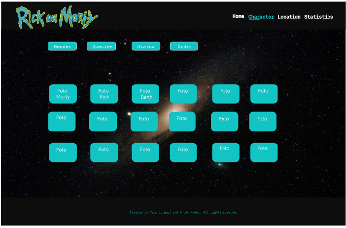

# Data Lovers : Fan page Rick and Morty 

## Índice

* [1. Preámbulo](#1-preámbulo)
* [2. Resumen del proyecto](#2-resumen-del-proyecto)
* [3. Definición del producto](#3-definición-del-producto)
* [4. Historias de usuario](#4-historias-de-usuario)
* [5. Prototipo de baja fidelidad](#5-prototipo-de-baja-fidelidad5)
* [6. Prototipo de alta fidelidad](#6-prototipo-de-alta-fidelidad)
* [7. Testeos de usabilidad](#7-testeos-de-usabilidad)
* [8. Checklist](#8-checklist)

***

## 1. Preámbulo

Rick y Morty es una serie de televisión americana de animación para adultos creada por Justin Roiland y Dan Harmon en 2013 para Adult Swim, también se emitió en Cartoon Network. La serie sigue las desventuras de un científico, Rick Sanchez, y su fácilmente influenciable nieto, Morty, quienes pasan el tiempo entre la vida doméstica y los viajes espaciales, temporales e intergalácticos. Dan Harmon, el co-creador de la serie y Justin Roiland son los encargados de las voces principales de Morty y Rick, la serie también incluye las voces de Chris Parnell, Spencer Grammer y Sarah Chalke.

La serie se originó por un cortometraje rudimentario animado por Roiland para el festival de cine Channel 101 llamado Doc and Mharti, una parodia de los principales protagonistas de Back to the Future. Cuando la cadena NBC despidió a Harmon en 2013 por discusiones entre él y los ejecutivos de la serie que había creado, Community, él y Roiland desarrollaron una serie basada en los personajes ya creados por Roiland.

## 2. Resumen del proyecto

Este proyecto se basó en crear una página web para aficionados de la serie de Rick and Morty o
personas que quieran conocer sobre la serie. Esta página logra ordenar, buscar, filtrar y mostrar estadisticas de diferentes caracteristicas de los personajes, según los datos de interés a partir de la data seleccionada.

## 3. Definición del producto

Este producto fue diseñado para que los usuarios obtengan información de forma ágil y rápida de los personajes que se encuentran en la serie.

La página web posee diferentes funciones como filtros, ordenar y búsqueda para facilitar la información de la serie a los usuarios, tanto los fanáticos o los que por primera vez la quieran ver.

Es un producto responsive por lo que se puede visualizar en diferentes dispositivos.

Este producto puede mostrar gráficas de caracteristicas de lo personajes como  procentajes  de las especies, el estado de vida y  el top 10 de donde se encuentran ubicados los personajes.

## 4. Historias de usuario

### Historia 1 

Yo como navegante de la serie animada Rick and Morty.
Quiero poder encontrar fácilmente quienes son mujeres, hombres o no definidos  existen en la serie.
Para poder diferenciar los personajes que me generan curiosidad.

Criterios de aceptación

1. Crear una función con filter para el requerimiento de búsqueda por género para los
usuarios.
2. Diseñar una interfaz que pueda mostrar por medio un card los nombres de los que son masculinos,femeninos y no defenidos.
3. Mediante un select mostrar la opción para los usuarios que desean cambiar las listas
por el filtro del género.

### Historia 2

Yo como navegante de la serie animada Rick and Morty.
Quiero poder ordenar alfabéticamente.
Para poder visualizar los nombres de manera ordenada. 

Criterios de aceptación

1. Crear una función con sorts para el requerimiento de orden por nombres.
2. Diseñar una interfaz que pueda mostrar todas las cards en orden alfábetico .
3. Mediante un select mostrar la opción para los usuarios que desean cambiar el orden alfabetico (A-Z) o (Z-A).

### Historia 3

Yo como navegante de la serie animada Rick and Morty.
Quiero poder buscar un personaje específico de la serie.
Para poder visualizar de manera individual el personaje.

Criterios de aceptación

1. Crear una función con filter con la condición de startsWith para el requerimiento de búsqueda por personajes específicos.
2. Diseñar una interfaz que pueda mostrar el personaje específico.
3. Mediante un input tipo texto poder escribir el personaje específico.

### Historia 4

Yo como navegante de la serie animada Rick and Morty.
Quiero poder interactuar desde mi teléfono u ordenador a la página web.
Para poder visualizar en diferentes diapositivos.

Criterios de aceptación

1. Crear un CSS media queries con interacción al HTML para el diseño responsive.
2. Utilizar las unidades relativas vh y rem para lograr que el diseño sea escalable.

### Historia 5

Yo como navegante de la serie animada Rick and Morty.
Quiero poder ver estádisticas de que especies,ubicación y estado de vida de los personajes.
Para entender quienes son los predominantes.

Criterios de aceptación

1. Tomar el link de chartjs.org para importara el diseño de las gráficas
2. Crear una función forEch para contar y tener el total de especies,ubicación y estado de vida de los personajes.
3. Crear variables con la funcion de newChar para invocar y lograr la interación del HTML,javaScript y chart.js.

## 5. Prototipo de baja fidelidad

## 6. Prototipo de alta fidelidad

[Figma](https://www.figma.com/file/zpUAV617XLAKNxqoVO8UW3/Rick-and-Morty-(Copy)?node-id=0%3A1&t=bjTV4323J62vcgvh-0) 

## 7. Testeos de usabilidad

Al realizar el test de usabilidad, alguno usuarios detectaron que al seleccionar el boton de filtrado en sus móviles no tomaba al primer click sino al segundo, por lo que nos vimos en la necesidad de cambiar el addEventListener del método click al método change en el archivo main.js.

Al hacer click en los personajes en los telefonos móviles los usuarios nos comunicaron que la tarjeta moda se veia distorcionaba por lo que fue necesarios cambios en el media  queries

## 8. Checklist

* [x] Usa VanillaJS.
* [x] Pasa linter (`npm run pretest`)
* [x] Pasa tests (`npm test`)
* [x] Pruebas unitarias cubren un mínimo del 70% de statements, functions y
  lines y branches.
* [x] Incluye _Definición del producto_ clara e informativa en `README.md`.
* [x] Incluye historias de usuario en `README.md`.
* [x] Incluye _sketch_ de la solución (prototipo de baja fidelidad) en
  `README.md`.
* [x] Incluye _Diseño de la Interfaz de Usuario_ (prototipo de alta fidelidad)
  en `README.md`.
* [x] Incluye link a figma en `README.md`.
* [x] Incluye el listado de problemas que detectaste a través de tests de
  usabilidad en el `README.md`.
* [x] UI: Muestra lista y/o tabla con datos y/o indicadores.
* [x] UI: Permite ordenar data por uno o más campos (asc y desc).
* [x] UI: Permite filtrar data en base a una condición.
* [x] UI: Es _responsive_.
